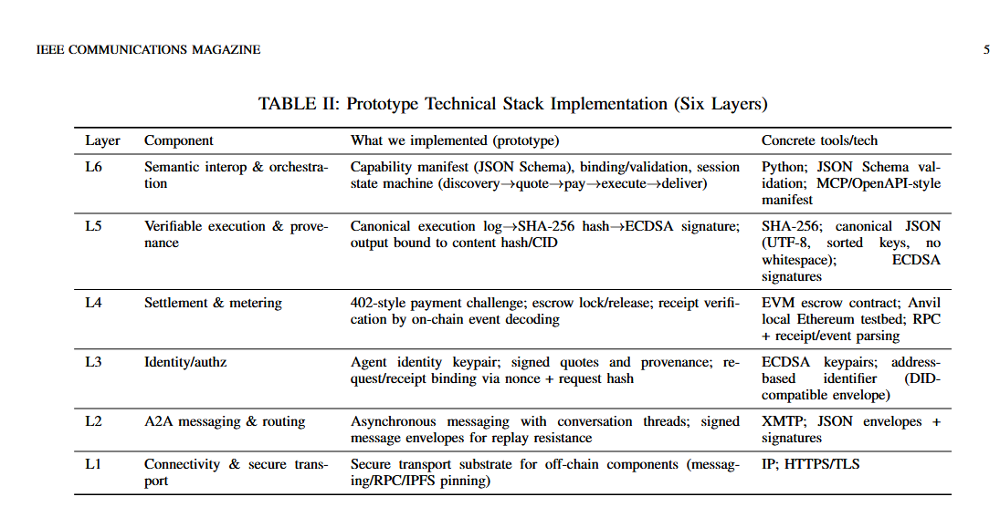
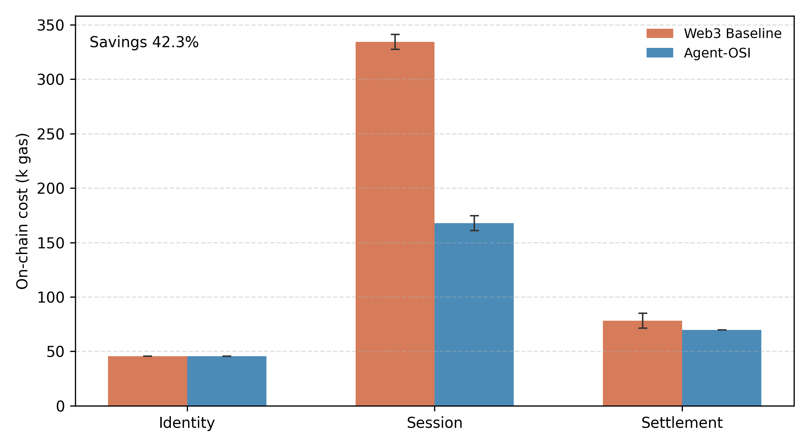
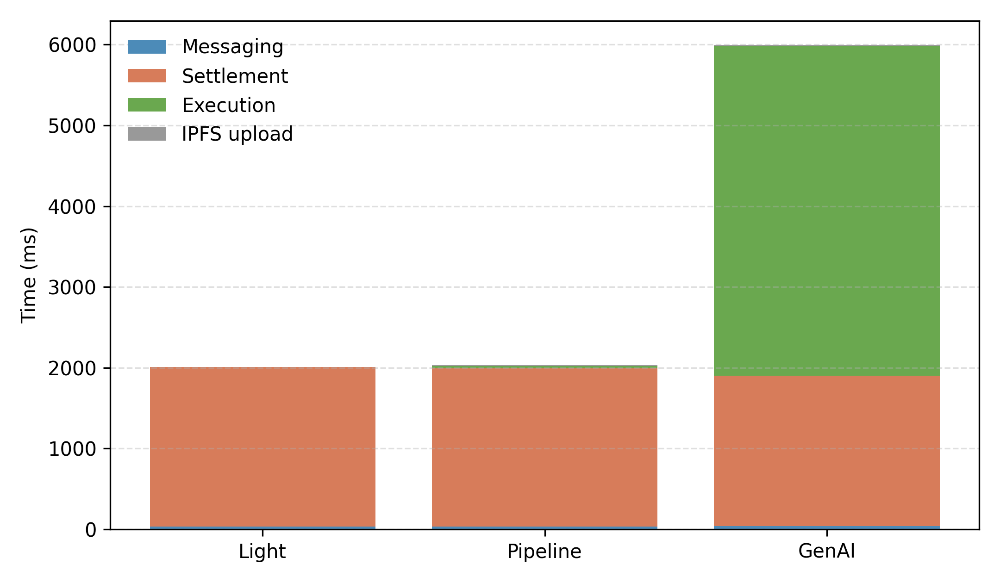
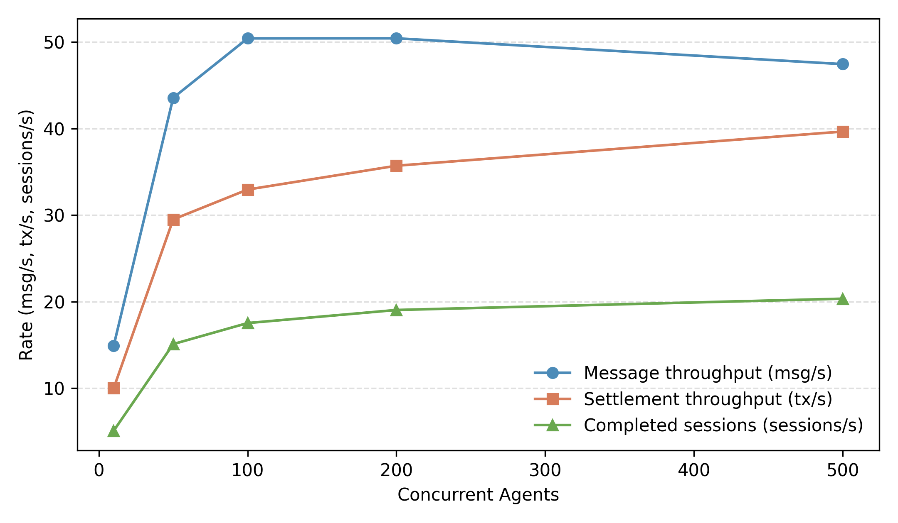

# AgentMarket 🚀

[English](README.md) | [中文](README.zh-CN.md)


AgentMarket is a proof-of-concept implementation of the Agent-OSI stack for pay-per-request agent services. It implements an end-to-end flow (discovery → quote → pay → execute → deliver) and produces the figures used in the experimental evaluation.

## Table of Contents

- [Highlights](#highlights)
- [Architecture](#architecture)
- [Visual Assets](#visual-assets)
- [Repository Layout](#repository-layout)
- [Workloads](#workloads)
- [Metrics](#metrics)
- [Requirements](#requirements)
- [Quick Start](#quick-start)
- [Run Experiments](#run-experiments)
- [Troubleshooting](#troubleshooting)
- [License](#license)

## Highlights ✨

- End-to-end pay-per-request flow with receipt-bound settlement
- Canonical execution logs with ECDSA provenance signatures
- Real A2A messaging (XMTP), content delivery (IPFS), and GenAI execution (ComfyUI SDXL)
- Reproducible experiment drivers for Fig.3 cost/latency/throughput

## Architecture 🧱

- **L6 Semantic interop & orchestration**: capability manifest, binding/validation, session state machine
- **L5 Verifiable execution & provenance**: canonical execution log → SHA-256 → ECDSA signature; output bound to CID
- **L4 Settlement & metering**: 402-style payment challenge; escrow lock/release; receipt verification by on-chain event decoding
- **L3 Identity/authz**: agent identity keypair; signed quotes and provenance; request/receipt binding via nonce + request hash
- **L2 A2A messaging & routing**: asynchronous messaging with conversation threads; signed message envelopes
- **L1 Connectivity & secure transport**: HTTPS/TLS for off-chain components (messaging/RPC/IPFS pinning)

## Visual Assets 🖼️

Prototype stack table:



Experiment figures:





## Repository Layout 🗂️

- `evm/`: Solidity contracts and Foundry tests
- `scripts/`: experiment drivers, plotting, and infrastructure helpers
- `configs/`: experiment configuration JSON
- `visual_assets/`: figures and table used in documentation

Generated experiment outputs are written to `outputs/` (ignored by Git).

## Workloads 🔬

All workloads share the same session flow but differ in execution cost and delivery size:

- **Light (no-gen)**: schema validation + provenance; returns 1–5KB JSON inline over L2
- **Pipeline (K-step)**: fixed K-step pipeline + 256KB artifact delivered via IPFS CID
- **GenAI (image/LLM)**: SDXL image generation; output delivered via IPFS CID

Pipeline configuration (default):

- `K = 5` (`configs/fig3.json`)
- Each step hashes the previous state and signs it (`run_pipeline` in `scripts/collect_latency.py`)

## Metrics 📈

- **Fig.3a Cost**: gasUsed per completed paid session (network fees excluded)
- **Fig.3b Latency**: messaging, settlement confirmation, execution (execution includes IPFS upload)
- **Fig.3c Throughput**: msg/s, tx/s, sessions/s under increasing concurrency (UA → 1 SA)

## Requirements ✅

- Python 3.10+
- Node.js (XMTP CLI bridge)
- Foundry (contracts)
- Anvil (local EVM)
- IPFS Kubo
- ComfyUI (SDXL workflow)
- XMTP node (local or remote)

## Quick Start ⚡

Start local infra (optional helper):

```bash
./scripts/infrastructure/start_infrastructure.sh
```

## Run Experiments 🧪

### Fig3a (Cost)

```bash
bash scripts/run_cost_exp.sh
```

### Fig3b (Latency, real XMTP + IPFS + ComfyUI)

```bash
XMTP_PEER="0x70997970C51812dc3A010C7d01b50e0d17dc79C8" \
COMFYUI_URL="http://127.0.0.1:8188" \
COMFYUI_WORKFLOW="scripts/infrastructure/comfyui_sdxl_1024_30.json" \
bash scripts/run_latency_exp.sh
```

### Fig3c (Throughput, real XMTP)

```bash
XMTP_PEER="0x70997970C51812dc3A010C7d01b50e0d17dc79C8" \
bash scripts/run_throughput_exp.sh
```

## Troubleshooting 🛠️

- Use Anvil block-time 2s for stable settlement timing.
- Fig3c with concurrency=500 requires many Anvil accounts (>= 502).
- If IPFS is unavailable, Fig3b will fail at upload; check `IPFS_API`.
- XMTP uses a bridge process; if you see installation/DB errors, use a fresh `XMTP_PRIVATE_KEY`.

## License 📜

This project is licensed under the [MIT License](LICENSE).
